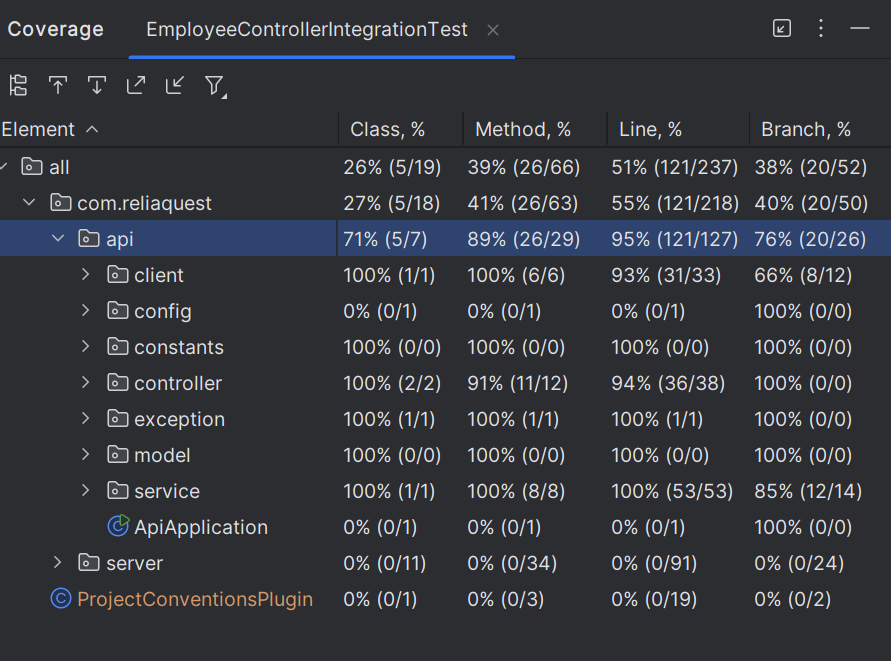

## Features

### API Endpoints

#### Implemented APIs
| Endpoint | HTTP Method | Description | Response |
|----------|-------------|-------------|----------|
| `/v1/employees` | `GET` | Fetch all employees | List of `EmployeeDTO` |
| `/v1/employees/search/{name}` | `GET` | Search employees by name | Filtered list of `EmployeeDTO` |
| `/v1/employees/{id}` | `GET` | Get employee by ID | Single `EmployeeDTO` |
| `/v1/employees/highestSalary` | `GET` | Fetch the highest salary | Integer |
| `/v1/employees/topTenHighestEarningEmployeeNames` | `GET` | Fetch top 10 earners | List of names |
| `/v1/employees` | `POST` | Create a new employee | Newly created `EmployeeDTO` |
| `/v1/employees/{id}` | `DELETE` | Delete an employee by ID | Success Message |

#### External APIs (Mock API)
| Endpoint | HTTP Method | Description |
|----------|-------------|-------------|
| `/api/v1/employee` | `GET` | Fetch all employees |
| `/api/v1/employee/{id}` | `GET` | Fetch an employee by ID |
| `/api/v1/employee` | `POST` | Create a new employee |
| `/api/v1/employee` | `DELETE` | Delete employee by name |

---

## Final Test Coverage Report

### Key Components

1. **Controller** (`EmployeeController`):
    - Handles API requests and delegates to the service layer.
    - Implements input validation and returns appropriate HTTP responses.

2. **Service Layer** (`EmployeeService`):
    - Central business logic, including filtering, transformation, and execution.
    - Handles exception propagation and logs at critical points.

3. **Client Layer** (`ExternalApiClient`):
    - Interfaces with the mock API using `RestTemplate`.
    - Encapsulates HTTP operations and response parsing.

4. **Validation and Exception Handling**:
    - `@Valid` for input validation.
    - `EmployeeControllerAdvice` for exception mapping to HTTP responses.

5. **Utilities**:
    - `ApiConstants` for endpoint and configuration constants.

---

### Development and Testing

#### Development Tools
- **Spring Boot**: For building the API layer.
- **Lombok**: For concise data models and constructors.
- **JUnit**: For unit and integration testing.
- **Mockito**: For mocking dependencies.
- **Spotless**: For code formatting.

#### Testing Strategy
- **Integration Tests**: Test end-to-end API behavior against the mock server by mocking the response.

#### Running the Application
- Mock server: `./gradlew server:bootRun`
- Main application: `./gradlew api:bootRun`

## --- Original README ---

# Implement this API

#### In this assessment you will be tasked with filling out the functionality of different methods that will be listed further down.

These methods will require some level of API interactions with Mock Employee API at http://localhost:8112/api/v1/employee.

Please keep the following in mind when doing this assessment:
* clean coding practices
* test driven development
* logging
* scalability

### Endpoints to implement

_See `com.reliaquest.api.controller.IEmployeeController` for details._

getAllEmployees()

    output - list of employees
    description - this should return all employees

getEmployeesByNameSearch(...)

    path input - name fragment
    output - list of employees
    description - this should return all employees whose name contains or matches the string input provided

getEmployeeById(...)

    path input - employee ID
    output - employee
    description - this should return a single employee

getHighestSalaryOfEmployees()

    output - integer of the highest salary
    description - this should return a single integer indicating the highest salary of amongst all employees

getTop10HighestEarningEmployeeNames()

    output - list of employees
    description - this should return a list of the top 10 employees based off of their salaries

createEmployee(...)

    body input - attributes necessary to create an employee
    output - employee
    description - this should return a single employee, if created, otherwise error

deleteEmployeeById(...)

    path input - employee ID
    output - name of the employee
    description - this should delete the employee with specified id given, otherwise error

### Testing
Please include proper integration and/or unit tests.
